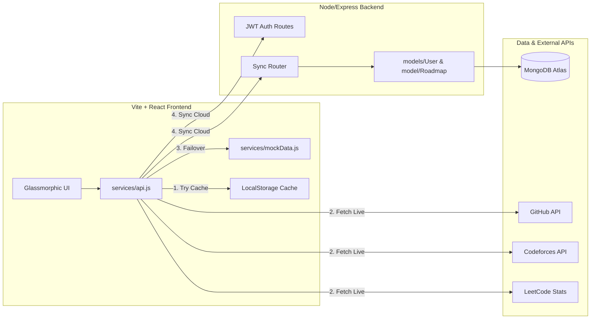

# DevPulse ⚡ 

### Unified Developer Profile Analytics & Coding Contest Dashboard
> **A high-performance full-stack (MERN) monorepo designed specifically to demonstrate production-grade engineering, visual polish, and automated delivery pipelines.**

[](#)
[](#)
[](#)
[](#)
[](#)
[](#)

---

## 🔗 Live Demo
* **✨ [Interactive Live Dashboard Link](https://nishulmehta24.github.io/dev-profile-tracker-dashboard/)** (Loads in under 1 second using direct clientside API connectors and custom offline mock fallbacks!)

---

## 🌟 Strategic Key Features

### 1. Ambient Glassmorphic Dashboard
* Sleek dark mode interfaces featuring transparent CSS blurs, floating ambient glows, and responsive flex grids.
* Custom, platform-specific branded glow border card overlays (GitHub Emerald, LeetCode Amber, Codeforces Blue, CodeChef Crimson).

### 2. Custom Interactive SVG Trajectory Chart
* Written entirely from scratch using native SVG Bezier curves and HSL gradients (avoiding heavy bundle chart libraries).
* Fully interactive coordinates with dynamic floating tooltips, contest details, and rating point tracking.

### 3. Unified Activity Heatmap Calendar
* A native year-round submission grid (53 columns x 7 rows) aggregating commit activity on GitHub and contest submissions on LeetCode/Codeforces/CodeChef.
* Popover details with date-specific contribution counts.

### 4. Contest Calendar with Countdowns
* Direct connection to public coding APIs to compile upcoming contest dates (Codeforces, LeetCode, AtCoder, CodeChef).
* **Live Countdown Timers:** Ticking clocks counting down to start times, with glowing Crimson "LIVE NOW" indicators.
* **1-Click Google Calendar Sync:** Generates pre-populated Calendar event forms instantly with duration, url, and platform details.

### 5. Custom Roadmaps & Circular Progress
* Interactive problem-solving checklist sheets (e.g. SDE Prep Sheets).
* Dynamic circular SVG progress bars displaying percentages with glowing drop-shadows.
* **State Persistence:** Local storage persistence + automated REST synchronization to MongoDB.

---

## 📡 Architecture Overview



---

## 🛠️ Local Installation & Quickstart

Get the full-stack system running locally in under 3 minutes:

### 1. Clone the repository
```bash
git clone https://github.com/nishulmehta24/dev-profile-tracker-dashboard.git
cd dev-profile-tracker-dashboard/dev-profile-dashboard
```

### 2. Install all dependencies (Frontend & Backend in 1 command)
We configured root npm shortcuts to install both environments concurrently:
```bash
npm run install-all
```

### 3. Setup Backend Environment Secrets
Duplicate the backend `.env.example` to `.env` inside the `/server` folder and fill in your connection details:
```bash
cp server/.env.example server/.env
```
Open `server/.env` and insert your JWT Secret and MongoDB Connection string.

### 4. Boot the full-stack system
Launches BOTH the Vite React dev server (`http://localhost:5173`) and the Express Node server (`http://localhost:5000`) simultaneously in a single terminal tab:
```bash
npm run dev
```

---

## 🚀 1-Click Publishing & Deployment

### Part A: Deploy Frontend Client to GitHub Pages (Automated CI/CD)
The repository contains an automated GitHub Actions workflow inside `.github/workflows/deploy.yml`:
1. Push your code to your `main` branch: `git push origin main`.
2. The GitHub Action will trigger, install client dependencies, compile the production bundle, and push it to a `gh-pages` branch.
3. Open your GitHub Repo settings -> Pages, select the `gh-pages` branch, and click Save. Your site is live!

### Part B: Deploy Backend Server to Render
1. Create a free account on [Render](https://render.com).
2. Create a "Web Service", connect your GitHub repository, and select `dev-profile-dashboard/server` as the root directory.
3. Select "Node" as the environment, set Build Command to `npm install`, and Start Command to `npm start`.
4. In Environment Variables, add `MONGO_URI` (from MongoDB Atlas) and `JWT_SECRET`. Click deploy!
5. In your frontend Settings page, paste your live Render server URL. They are now linked in the cloud!


devloped by yash Agarwal and Nishul Mehta 
